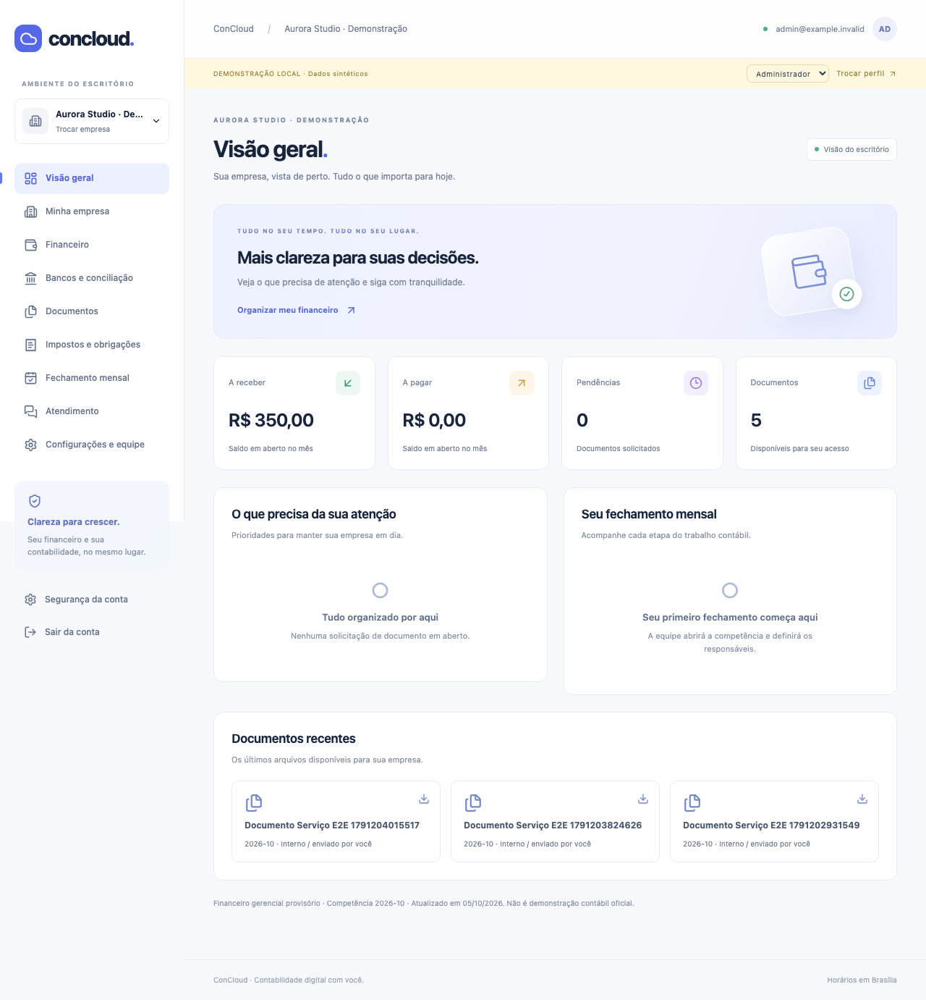

# ConCloud

Plataforma brasileira de contabilidade digital com ERP financeiro e fechamento mensal por empresa. Monólito Next.js + Prisma/PostgreSQL, Supabase Auth/Storage e worker BullMQ/Redis. Interface em português, responsiva, sem números inventados fora da demonstração identificada.

A jornada local inclui cadastro, convite, upload privado, solicitações, financeiro, importação, conciliação, pacote versionado, processamento manual, revisão separada e publicação ao cliente. **Domínio é operação manual; não há integração automática nem apuração fiscal.**



## Iniciar localmente

Requisitos: Node 24 LTS (mínimo 22.12), npm, Docker para PostgreSQL/Redis. Sem Docker, há um PostgreSQL nativo opcional em `npm run local:db`; Redis deve estar instalado separadamente.

```bash
npm ci
npm run local:configure
# Cria .env de demonstração, sem sobrescrever um arquivo existente.
docker compose up -d
npm run db:generate
npm run db:migrate
npm run local:roles
npm run db:seed
npm run dev
```

Em outro terminal:

```bash
npm run worker
```

Abra [http://localhost:3100](http://localhost:3100). A faixa amarela identifica dados e perfis sintéticos. O seletor alterna administrador, revisor e cliente. O cliente inicial só acessa Aurora; Horizonte, da mesma organização, e a empresa de outra organização servem para verificar isolamento.

Sem Docker, execute `npm run local:db` em um terminal e `redis-server --bind 127.0.0.1 --port 6387` em outro. O PostgreSQL embutido escuta exclusivamente em 127.0.0.1:54322 e persiste em `.local/postgres`. A ferramenta opcional tem etiqueta beta upstream; não é a infraestrutura de produção.

O modo demonstração não envia e-mails, não usa identidades reais e armazena arquivos privados em `.local/storage`. Ele exige DB localhost e é desabilitado automaticamente em `NODE_ENV=production`. Não confunda a demonstração com autenticação Supabase homologada.

## Supabase compartilhado

Projeto fornecido: `https://peuqfdgkxkiaszrvpgmq.supabase.co`. O usuário confirmou que é compartilhado com outro sistema. O código usa **somente o schema privado `concloud`**; `prisma.config.ts` também força o histórico de migrations nesse schema. Não há migrations concorrentes do Supabase.

Para conectar o ambiente real, configure em `.env` (nunca no Git):

- `MIGRATION_DATABASE_URL`: conexão PostgreSQL com role de migration, apta a criar schema/roles/políticas. A chave service_role não substitui a senha PostgreSQL.
- `DATABASE_URL`: conexão com `concloud_runtime`, LOGIN, NOSUPERUSER e NOBYPASSRLS, senha própria.
- `DISPATCHER_DATABASE_URL`: conexão com `concloud_dispatcher`, senha própria, acesso restrito à outbox.
- `NEXT_PUBLIC_SUPABASE_URL` e `NEXT_PUBLIC_SUPABASE_ANON_KEY`.
- `SUPABASE_SERVICE_ROLE_KEY`: somente servidor, para Storage/setup. Nunca prefixar com NEXT_PUBLIC_.
- `REDIS_URL`, `APP_URL`, `DEMO_MODE=false`, `REQUIRE_STAFF_MFA=true`.

Execute migrations com a conexão administrativa. As roles são criadas NOLOGIN, sem senha; o operador deve habilitar LOGIN e definir senhas fortes por canal seguro. O script `local:roles` recusa bancos remotos e não deve ser adaptado com senhas reais no código. Não exponha `concloud` na Data API. Não altere as tabelas/políticas do outro sistema.

```bash
npm run db:migrate
npm run storage:setup
# Defina BOOTSTRAP_USER_ID de uma identidade Supabase já confirmada no .env.
npm run bootstrap
npm run build
npm start
# Processo separado:
npm run worker
```

O setup só administra o bucket privado `concloud-private`. Configure Auth Site URL, confirmação de e-mail, TOTP e URLs permitidas. Valide MFA em `/mfa` antes de operar como equipe. O bootstrap cria apenas o primeiro administrador, sem cadastro público privilegiado. Depois, cadastre empresas e gere convites de uso único em Configurações e equipe.

**Nenhuma alteração foi aplicada ao Supabase remoto nesta entrega sem a conexão PostgreSQL de migrations.** As credenciais compartilhadas na conversa não são versionadas. Como o projeto é compartilhado, qualquer rotação da service_role deve ser coordenada com os sistemas que a utilizam.

## Verificação

```bash
npm run typecheck
npm run lint
npm test
npm run build
npm audit --audit-level=high
# Com web, worker, PostgreSQL e Redis locais ativos:
npx playwright install chromium
npm run test:e2e
```

Vitest cobre cálculos, CNPJ numérico/alfanumérico, CSV/OFX, transições, pacotes determinísticos e RLS real. Os testes de serviços e migrations usam PostgreSQL nativo em bancos descartáveis, quando a conexão de migration é localhost; caso contrário são explicitamente ignorados. Playwright usa somente a demonstração local. A CI levanta PostgreSQL/Redis e executa ambas as camadas.

Evidências e limitações estão em [docs/verificacao.md](docs/verificacao.md). Não considerar a homologação de Auth/Storage/MFA remotos executada pelos testes locais.

## Organização do repositório

- `apps/web`: telas, autenticação, ações e serviços de aplicação.
- `apps/worker`: dispatcher outbox, BullMQ, pacotes e health.
- `packages/domain`: dinheiro, permissões, CNPJ, importação e fechamento.
- `packages/database`: schema, migrations únicas, contexto RLS e seed.
- `packages/integrations`: Storage, OFX, ManualAccountingAdapter e contratos futuros.
- `packages/ui`: componentes de interface no padrão shadcn.
- `tests`: domínio, RLS, serviços, migrations e jornadas Playwright.

## Documentação

- [Arquitetura e decisões](docs/arquitetura.md)
- [Permissões](docs/permissoes.md)
- [Manual contábil](docs/operacao-contabil.md)
- [Operação, backups e retenção](docs/operacao-tecnica.md)
- [Backlog e limites](docs/backlog.md)
- [Escopo original](docs/escopo.md)

Listas atuais são adequadas à operação inicial; paginação e testes de carga devem preceder escala. Limites: uploads 10 MB, CSV/OFX 5 MB e 10 mil linhas, pacote 100 MB. Relatórios financeiros são gerenciais provisórios. Pagamento informado não é confirmação bancária. Integrações Focus, Pluggy, cobrança e IA permanecem desativadas.
